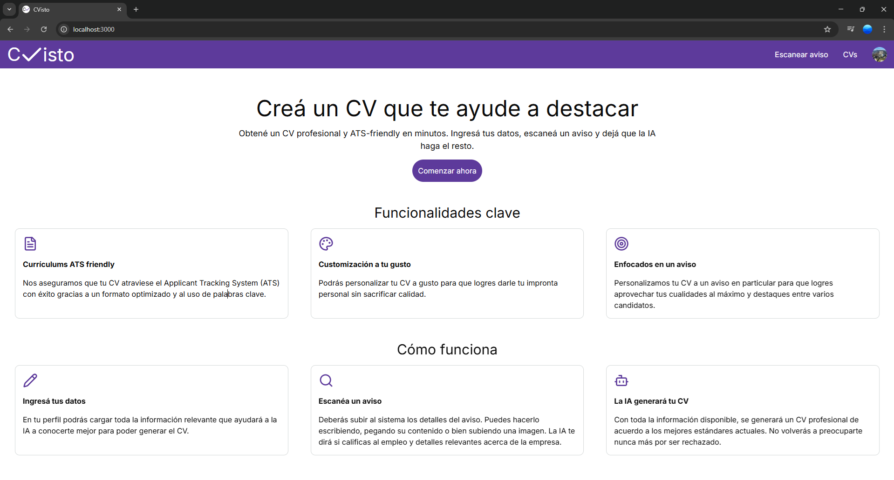
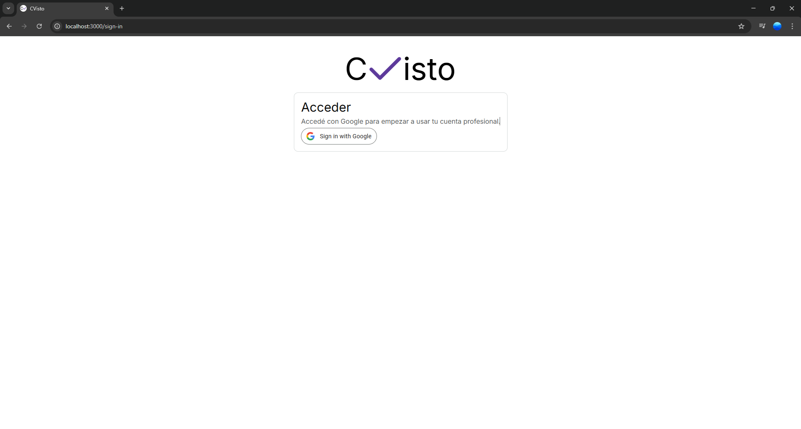
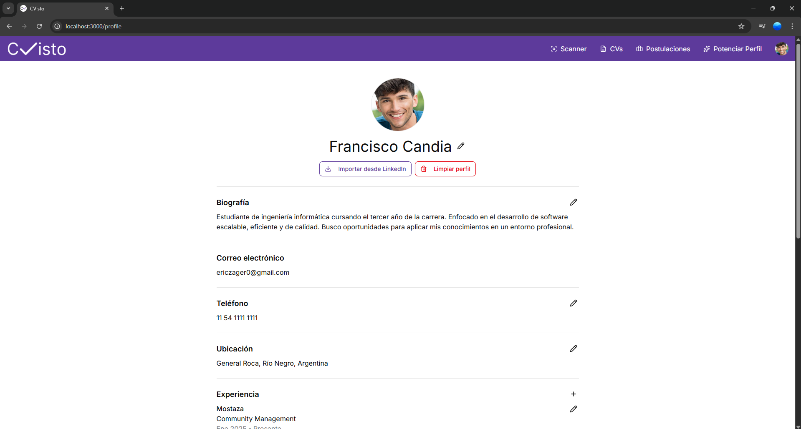
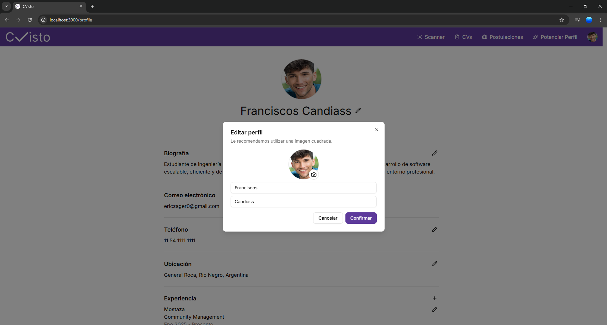

# CVisto

Plataforma SaaS que potencia tu empleabilidad: obtené un CV compatible con ATS en minutos.

## Tecnologías

- **Lenguajes / Frameworks**: React, Next.js (App Router) — arquitectura fullstack.
- **Persistencia**: PostgreSQL, con cliente postgres.js.
- **Autenticación**: Auth.js (Google como proveedor).
- **Interfaz y diseño**: shadcn/ui (componentes basados en Radix UI), Tailwind CSS, Lucide Icons.

## Screenshots

### Landing page

### Sign-in page

### Profile page

### Editing profile

