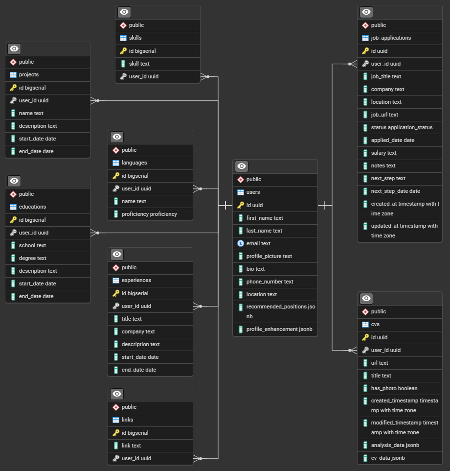

# CVisto

Plataforma SaaS que potencia tu empleabilidad: obtené un CV compatible con ATS en minutos.

## Estado del proyecto

En desarrollo activo.

## Tecnologías

- **Lenguajes / Frameworks**: React, Next.js (App Router) (arquitectura fullstack).
- **Persistencia**: PostgreSQL, con cliente postgres.js.
- **Almacenamiento de archivos**: Cloudinary, para gestión y entrega optimizada de imágenes y documentos.
- **Autenticación**: Auth.js (Google como proveedor).
- **Interfaz y diseño**: shadcn/ui (componentes basados en Radix UI), Tailwind CSS, Lucide Icons.
- **AI**: Google AI Studio (Gemini API) (Inteligencia artificial para generación de contenido y procesamiento de lenguaje natural).
- **Documentos**: docx para la construcción de los currículums.

## Esquema de la base de datos

## Screenshots

### Landing page

### Sign-in page

### Dashboard page

### Profile page

### Editing profile

### CVs page

### CVs empty page

### Uploading CV

### Job scanner page

### Job scanned

### Enhance profile page

### Postulations page

### Search jobs page

